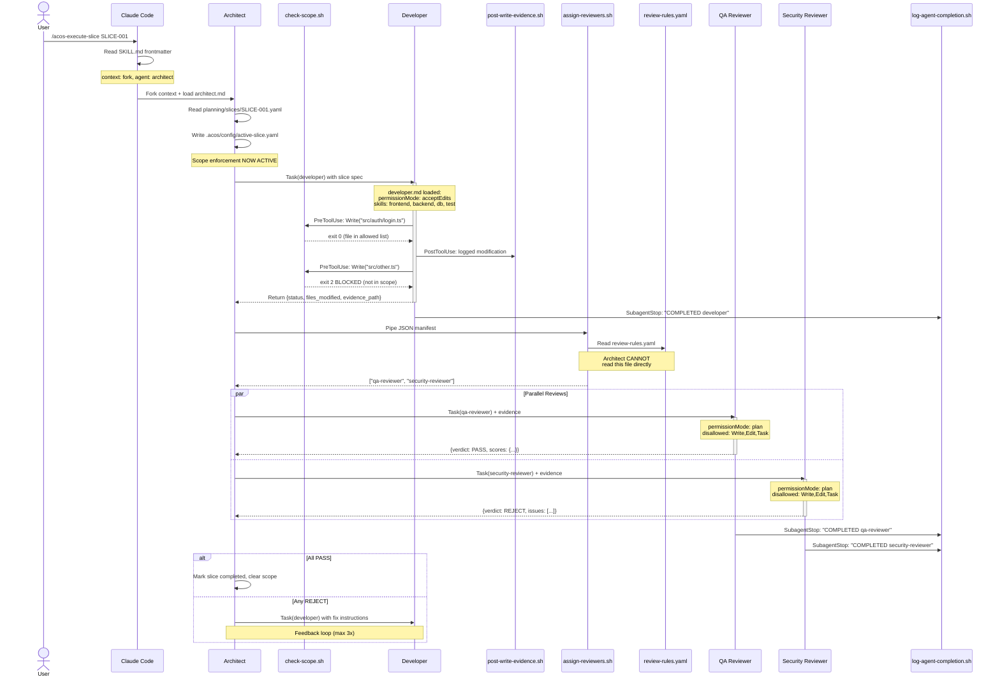

# ACOS v3.0 — Full Architecture Diagram

## 1. System Layers Overview

```
╔══════════════════════════════════════════════════════════════════════════════════╗
║                          ACOS v3.0 — THREE LAYERS                              ║
╠══════════════════════════════════════════════════════════════════════════════════╣
║                                                                                ║
║  LAYER 3: ACOS SKILLS (the protocols)                                          ║
║  ┌─────────────────────────────────┐  ┌──────────────────────────────────────┐  ║
║  │   ORCHESTRATION SKILLS          │  │   REGULAR SKILLS                     │  ║
║  │   (self-executing workflows)    │  │   (guidance documents)               │  ║
║  │                                 │  │                                      │  ║
║  │   context: fork                 │  │   No context/agent fields            │  ║
║  │   agent: architect              │  │   Injected into agent's context      │  ║
║  │                                 │  │                                      │  ║
║  │   /acos-execute-slice           │  │   frontend-coding                    │  ║
║  │   /acos-execute-story           │  │   backend-coding                     │  ║
║  │   /acos-execute-epic            │  │   database-design                    │  ║
║  │   /acos-complete-vision         │  │   testing                            │  ║
║  │   /acos-interview               │  │   security-audit                     │  ║
║  │   /acos-review                  │  │   deployment                         │  ║
║  │   /acos-plan                    │  │   bug-investigation                  │  ║
║  │   /acos-start                   │  │   codebase-analysis                  │  ║
║  │   /acos-learn                   │  │   technology-research                │  ║
║  │   /acos-decide                  │  │   api-documentation                  │  ║
║  │   /acos-handoff-protocol        │  │   user-guide-writing                 │  ║
║  │   /acos-status                  │  │   agent-creation                     │  ║
║  │   /acos-feedback-resolution     │  │   skill-creation                     │  ║
║  │                                 │  │   orchestration-creation             │  ║
║  └────────────────┬────────────────┘  └────────────────┬─────────────────────┘  ║
║                   │ forks context,                      │ loaded into            ║
║                   │ runs AS agent                       │ agent context          ║
║                   ▼                                     ▼                        ║
║  LAYER 2: ACOS AGENTS (the personas) ────────────────────────────────────────   ║
║  ┌──────────────────────────────────────────────────────────────────────────┐   ║
║  │                                                                          │   ║
║  │  ┌─────────────────────────────────────────────────────────┐             │   ║
║  │  │ ARCHITECT  (orchestrator)                                │             │   ║
║  │  │ model: opus | permissionMode: default | maxTurns: 100   │             │   ║
║  │  │ tools: Read,Write,Edit,Glob,Grep,Bash,Web,Task(*)      │             │   ║
║  │  │ skills: acos-plan, acos-interview, agent/skill-creation │             │   ║
║  │  │ memory: project                                          │             │   ║
║  │  │ hook: block-review-rules-read.sh on Read                │             │   ║
║  │  │                                                          │             │   ║
║  │  │  Can spawn ──┬─► Task(developer)                        │             │   ║
║  │  │              ├─► Task(qa-reviewer)                       │             │   ║
║  │  │              ├─► Task(security-reviewer)                 │             │   ║
║  │  │              ├─► Task(performance-reviewer)              │             │   ║
║  │  │              ├─► Task(integration-reviewer)              │             │   ║
║  │  │              ├─► Task(memory-agent)                      │             │   ║
║  │  │              └─► Task(learning-agent)                    │             │   ║
║  │  └─────────────────────────────────────────────────────────┘             │   ║
║  │                                                                          │   ║
║  │  ┌──────────────────────┐  ┌───────────────────────────────────────┐     │   ║
║  │  │ DEVELOPER            │  │ REVIEWERS (x4, identical constraints) │     │   ║
║  │  │ model: opus          │  │ qa-reviewer    | security-reviewer    │     │   ║
║  │  │ perm: acceptEdits    │  │ perf-reviewer  | integration-reviewer │     │   ║
║  │  │ maxTurns: 50         │  │                                       │     │   ║
║  │  │ tools: R/W/Edit/     │  │ model: opus                          │     │   ║
║  │  │   Glob/Grep/Bash     │  │ permissionMode: plan (READ-ONLY)     │     │   ║
║  │  │ disallowed: Task,    │  │ maxTurns: 30                         │     │   ║
║  │  │   Web                │  │ tools: Read/Glob/Grep/Bash           │     │   ║
║  │  │ skills: frontend,    │  │ disallowed: Write/Edit/Task/Web      │     │   ║
║  │  │   backend, db, test  │  │ skills: (none)                       │     │   ║
║  │  │ hook: check-scope.sh │  │ hooks: (none — already locked down)  │     │   ║
║  │  └──────────────────────┘  └───────────────────────────────────────┘     │   ║
║  │                                                                          │   ║
║  │  ┌──────────────────────┐  ┌──────────────────────┐                     │   ║
║  │  │ MEMORY AGENT         │  │ LEARNING AGENT       │                     │   ║
║  │  │ model: sonnet        │  │ model: opus          │                     │   ║
║  │  │ perm: default        │  │ perm: default        │                     │   ║
║  │  │ maxTurns: 20         │  │ maxTurns: 30         │                     │   ║
║  │  │ memory: project      │  │ memory: user         │                     │   ║
║  │  │ disallowed: Task/Web │  │   (cross-project!)   │                     │   ║
║  │  │ RAG over memory/     │  │ disallowed: Task/Web │                     │   ║
║  │  └──────────────────────┘  └──────────────────────┘                     │   ║
║  └──────────────────────────────────────────────────────────────────────────┘   ║
║                   │ agents configured via                                       ║
║                   │ YAML frontmatter fields                                     ║
║                   ▼                                                             ║
║  LAYER 1: CLAUDE CODE PRIMITIVES (the platform) ─────────────────────────────   ║
║  ┌──────────────────────────────────────────────────────────────────────────┐   ║
║  │                                                                          │   ║
║  │  CLAUDE.md ──── auto-loads project context at session start              │   ║
║  │                                                                          │   ║
║  │  .claude/agents/*.md ──── agent definitions (YAML frontmatter + body)    │   ║
║  │  .claude/skills/*/SKILL.md ── skill definitions (auto-discovered by /)   │   ║
║  │  .claude/settings.local.json ── hooks + permissions                      │   ║
║  │  .claude/scripts/*.sh ──── enforcement shell scripts                     │   ║
║  │                                                                          │   ║
║  │  ┌──────────────────┐ ┌─────────────────┐ ┌──────────────────────────┐  │   ║
║  │  │ YAML Frontmatter │ │ Task() calls    │ │ Hook System              │  │   ║
║  │  │ Fields:          │ │                 │ │                          │  │   ║
║  │  │  name            │ │ Spawns isolated │ │ PreToolUse: fires BEFORE │  │   ║
║  │  │  model           │ │ agent subprocess│ │ PostToolUse: fires AFTER │  │   ║
║  │  │  tools           │ │ with own context│ │ SubagentStop: on finish  │  │   ║
║  │  │  disallowedTools │ │                 │ │                          │  │   ║
║  │  │  permissionMode  │ │ Return value    │ │ exit 0 = allow           │  │   ║
║  │  │  maxTurns        │ │ goes back to    │ │ exit 2 = block           │  │   ║
║  │  │  skills          │ │ the caller      │ │                          │  │   ║
║  │  │  memory          │ │                 │ │ Receives JSON on stdin   │  │   ║
║  │  │  hooks           │ │                 │ │ with tool_input details  │  │   ║
║  │  │  context         │ │                 │ │                          │  │   ║
║  │  │  agent           │ │                 │ │                          │  │   ║
║  │  └──────────────────┘ └─────────────────┘ └──────────────────────────┘  │   ║
║  └──────────────────────────────────────────────────────────────────────────┘   ║
╚══════════════════════════════════════════════════════════════════════════════════╝
```


## 2. Enforcement Stack — The Independence Wall

```
╔══════════════════════════════════════════════════════════════════════════════════╗
║                     MECHANICAL ENFORCEMENT (10 scripts)                         ║
╠══════════════════════════════════════════════════════════════════════════════════╣
║                                                                                ║
║  HOOKS (settings.local.json)          AGENT-LEVEL (YAML frontmatter)           ║
║  ─────────────────────────            ──────────────────────────────            ║
║                                                                                ║
║  PreToolUse [Write|Edit] ──────────► check-scope.sh                            ║
║  │  Fires before any file write        │                                       ║
║  │  Reads .acos/config/active-slice    │  ┌─────────────────────────────────┐  ║
║  │  yaml and checks files_allowed      ├──│ exit 0 → Write proceeds         │  ║
║  │  list. Blocks out-of-scope writes.  │  │ exit 2 → "BLOCKED: not in       │  ║
║  │                                     │  │           active slice"          │  ║
║  │                                     │  └─────────────────────────────────┘  ║
║  │                                                                             ║
║  PostToolUse [Write|Edit] ─────────► post-write-evidence.sh                    ║
║  │  Fires after every file write       │                                       ║
║  │  Appends timestamped entry to       │  Always exit 0                        ║
║  │  .acos/evidence/current/            │  (logging only, never blocks)         ║
║  │  modifications.log                  │                                       ║
║  │                                                                             ║
║  SubagentStop [*] ─────────────────► log-agent-completion.sh                   ║
║  │  Fires when any spawned agent       │                                       ║
║  │  finishes its Task()                │  Appends to                           ║
║  │  Logs agent name + timestamp        │  .acos/metrics/agent-completions.log  ║
║  │                                                                             ║
║  ═══════════════════════════════════════════════════════════════════            ║
║  ║              THE INDEPENDENCE WALL                              ║            ║
║  ═══════════════════════════════════════════════════════════════════            ║
║                                                                                ║
║  Architect-side barriers:              Reviewer-side barriers:                  ║
║  ┌──────────────────────────┐          ┌──────────────────────────────────┐     ║
║  │ PreToolUse hook on Read  │          │ disallowedTools:                 │     ║
║  │ ► block-review-rules-    │          │   Write, Edit, Task             │     ║
║  │   read.sh                │          │                                  │     ║
║  │                          │          │ permissionMode: plan             │     ║
║  │ If file contains         │          │   (runtime read-only)            │     ║
║  │ "review-rules" → exit 2  │          │                                  │     ║
║  │ "INDEPENDENCE WALL:      │          │ Task() isolation                 │     ║
║  │  Architect cannot read   │          │   (cannot see Architect context, │     ║
║  │  review-rules.yaml"      │          │    other reviewers, or any       │     ║
║  └──────────────────────────┘          │    decisions outside their       │     ║
║                                        │    explicit input)               │     ║
║  Bridge across the wall:               └──────────────────────────────────┘     ║
║  ┌──────────────────────────────────────────────────────────────────────┐       ║
║  │ assign-reviewers.sh                                                  │       ║
║  │                                                                      │       ║
║  │  The Architect pipes a JSON manifest ──► script reads review-rules   │       ║
║  │  .yaml internally ──► returns only reviewer names as JSON array      │       ║
║  │                                                                      │       ║
║  │  Architect sees: ["qa-reviewer", "security-reviewer"]                │       ║
║  │  Architect CANNOT see: the trigger rules, thresholds, or patterns    │       ║
║  │  that caused those reviewers to be assigned                          │       ║
║  └──────────────────────────────────────────────────────────────────────┘       ║
║                                                                                ║
║  Remaining scripts (supporting):                                               ║
║  ┌──────────────────────────────────────────────────────────────────────┐       ║
║  │ create-evidence-bundle.sh ── scaffolds evidence directory structure  │       ║
║  │ validate-evidence.sh ─────── checks evidence completeness           │       ║
║  │ archive-project.sh ───────── archives completed project artifacts   │       ║
║  │ rag-index.sh ─────────────── indexes memory for RAG retrieval       │       ║
║  │ rag-query.sh ─────────────── queries RAG index                      │       ║
║  └──────────────────────────────────────────────────────────────────────┘       ║
╚══════════════════════════════════════════════════════════════════════════════════╝
```


## 3. Runtime Execution Flow — /acos-execute-slice

```
╔══════════════════════════════════════════════════════════════════════════════════╗
║              RUNTIME: What happens when you type /acos-execute-slice            ║
╠══════════════════════════════════════════════════════════════════════════════════╣
║                                                                                ║
║  YOU type: /acos-execute-slice SLICE-001                                       ║
║  │                                                                             ║
║  │  Claude Code reads .claude/skills/acos-execute-slice/SKILL.md               ║
║  │  Frontmatter says: context: fork, agent: architect                          ║
║  │                                                                             ║
║  ▼                                                                             ║
║  ┌──────────────────────────────────────────────────────────────────────┐       ║
║  │  FORKED CONTEXT — Architect agent loaded                            │       ║
║  │  (architect.md frontmatter applied: tools, hooks, skills, model)    │       ║
║  │                                                                     │       ║
║  │  STEP 1: Read slice spec                                           │       ║
║  │  ├─ Read("planning/slices/SLICE-001.yaml")                         │       ║
║  │  │   └─ PreToolUse(Read) → block-review-rules-read.sh             │       ║
║  │  │     └─ "SLICE-001.yaml" does not match "review-rules" → exit 0 │       ║
║  │  └─ Extracts: objective, criteria, files_allowed, dependencies     │       ║
║  │                                                                     │       ║
║  │  STEP 2: Set scope                                                 │       ║
║  │  ├─ Write(".acos/config/active-slice.yaml")                        │       ║
║  │  │   └─ PreToolUse(Write) → check-scope.sh                        │       ║
║  │  │     └─ Path starts with ".acos/" → always allowed → exit 0     │       ║
║  │  │   └─ PostToolUse(Write) → post-write-evidence.sh               │       ║
║  │  │     └─ Logs: "MODIFIED .acos/config/active-slice.yaml"         │       ║
║  │  └─ Scope enforcement now ACTIVE for all subsequent writes         │       ║
║  │                                                                     │       ║
║  │  STEP 3: Create evidence bundle                                    │       ║
║  │  └─ Bash("./claude/scripts/create-evidence-bundle.sh SLICE-001")  │       ║
║  │                                                                     │       ║
║  │  STEP 4: Delegate to Developer                                     │       ║
║  │  ┌──────────────────────────────────────────────────────────────┐  │       ║
║  │  │  Task(developer)  ─── ISOLATED SUBPROCESS ───────────────── │  │       ║
║  │  │  │                                                          │  │       ║
║  │  │  │  developer.md loaded:                                    │  │       ║
║  │  │  │    permissionMode: acceptEdits                           │  │       ║
║  │  │  │    skills: [frontend, backend, db, testing] loaded       │  │       ║
║  │  │  │    hook: check-scope.sh on Write|Edit                    │  │       ║
║  │  │  │                                                          │  │       ║
║  │  │  │  Developer writes code:                                  │  │       ║
║  │  │  │  ├─ Write("src/auth/login.ts")                          │  │       ║
║  │  │  │  │   ├─ PreToolUse → check-scope.sh                    │  │       ║
║  │  │  │  │   │   └─ "login.ts" in files_allowed? YES → exit 0  │  │       ║
║  │  │  │  │   └─ PostToolUse → post-write-evidence.sh            │  │       ║
║  │  │  │  │       └─ Logs: "MODIFIED src/auth/login.ts"          │  │       ║
║  │  │  │  │                                                       │  │       ║
║  │  │  │  ├─ Write("src/unrelated/other.ts")  ← OUT OF SCOPE    │  │       ║
║  │  │  │  │   └─ PreToolUse → check-scope.sh                    │  │       ║
║  │  │  │  │       └─ "other.ts" NOT in files_allowed → exit 2   │  │       ║
║  │  │  │  │       └─ "BLOCKED: not in active slice"              │  │       ║
║  │  │  │  │                                                       │  │       ║
║  │  │  │  └─ Creates evidence bundle (before/after/verify/Summary)│  │       ║
║  │  │  │                                                          │  │       ║
║  │  │  │  Returns YAML: {status, files_modified, evidence_path}   │  │       ║
║  │  │  └──────────────────────────────────────────────────────────┘  │       ║
║  │  │     │                                                          │       ║
║  │  │     └─ SubagentStop hook → log-agent-completion.sh             │       ║
║  │  │         └─ Logs: "COMPLETED developer"                         │       ║
║  │  │                                                                │       ║
║  │  ▼                                                                │       ║
║  │  STEP 5: Assign reviewers                                         │       ║
║  │  ├─ Architect pipes JSON manifest to assign-reviewers.sh          │       ║
║  │  │   {"files_modified":["src/auth/login.ts"],                     │       ║
║  │  │    "code_snippets":["password","jwt"]}                         │       ║
║  │  │                                                                │       ║
║  │  │   ┌─ assign-reviewers.sh ───────────────────────────────┐     │       ║
║  │  │   │  Reads review-rules.yaml (Architect CANNOT)         │     │       ║
║  │  │   │  Matches: "auth" in path → security-reviewer        │     │       ║
║  │  │   │  Matches: "jwt" in code → security-reviewer         │     │       ║
║  │  │   │  Global rule: qa always required                    │     │       ║
║  │  │   │  Returns: ["qa-reviewer", "security-reviewer"]      │     │       ║
║  │  │   └─────────────────────────────────────────────────────┘     │       ║
║  │  │                                                                │       ║
║  │  ▼                                                                │       ║
║  │  STEP 6: Spawn reviewers IN PARALLEL                              │       ║
║  │                                                                   │       ║
║  │  ┌─ Task(qa-reviewer) ────────┐  ┌─ Task(security-reviewer) ──┐  │       ║
║  │  │  ISOLATED SUBPROCESS       │  │  ISOLATED SUBPROCESS        │  │       ║
║  │  │                            │  │                             │  │       ║
║  │  │  qa-reviewer.md loaded:    │  │  security-reviewer.md:      │  │       ║
║  │  │  permissionMode: plan      │  │  permissionMode: plan       │  │       ║
║  │  │  disallowed: Write,Edit,   │  │  disallowed: Write,Edit,    │  │       ║
║  │  │    Task                    │  │    Task                     │  │       ║
║  │  │                            │  │                             │  │       ║
║  │  │  Can ONLY:                 │  │  Can ONLY:                  │  │       ║
║  │  │    Read evidence bundle    │  │    Read evidence bundle     │  │       ║
║  │  │    Read source of truth    │  │    Read source of truth     │  │       ║
║  │  │    Read slice spec         │  │    Read slice spec          │  │       ║
║  │  │    Read source code        │  │    Read source code         │  │       ║
║  │  │    Run verification cmds   │  │    Run verification cmds    │  │       ║
║  │  │                            │  │                             │  │       ║
║  │  │  CANNOT:                   │  │  CANNOT:                    │  │       ║
║  │  │    See Architect decisions  │  │    See Architect decisions   │  │       ║
║  │  │    See other reviewer      │  │    See other reviewer       │  │       ║
║  │  │    Modify any file         │  │    Modify any file          │  │       ║
║  │  │    Spawn sub-agents        │  │    Spawn sub-agents         │  │       ║
║  │  │                            │  │                             │  │       ║
║  │  │  Returns:                  │  │  Returns:                   │  │       ║
║  │  │  {verdict: PASS|REJECT,    │  │  {verdict: PASS|REJECT,     │  │       ║
║  │  │   scores: {...},           │  │   scores: {...},            │  │       ║
║  │  │   issues: [...]}           │  │   issues: [...]}            │  │       ║
║  │  └────────────────────────────┘  └─────────────────────────────┘  │       ║
║  │       │                                │                          │       ║
║  │       │  SubagentStop hooks fire        │                          │       ║
║  │       └──────────┬─────────────────────┘                          │       ║
║  │                  ▼                                                 │       ║
║  │  STEP 7: Aggregate verdicts                                       │       ║
║  │  ┌────────────────────────────────────────────┐                   │       ║
║  │  │  All PASS?                                  │                   │       ║
║  │  │  ├─ YES → Step 9 (completion)               │                   │       ║
║  │  │  └─ NO  → Step 8 (feedback resolution)      │                   │       ║
║  │  └────────────────────────────────────────────┘                   │       ║
║  │                                                                   │       ║
║  │  STEP 8: Feedback resolution (on REJECT)                          │       ║
║  │  ├─ Invokes acos-feedback-resolution skill                        │       ║
║  │  ├─ Architect analyzes ALL feedback together                      │       ║
║  │  ├─ Creates coherent fix plan                                     │       ║
║  │  ├─ Re-delegates to Task(developer) with fix instructions         │       ║
║  │  ├─ Re-runs reviewer assignment + parallel reviewers              │       ║
║  │  └─ Repeats up to 3x, then escalates to human                    │       ║
║  │                                                                   │       ║
║  │  STEP 9: Completion                                               │       ║
║  │  ├─ Updates planning/slices/SLICE-001.yaml → status: completed    │       ║
║  │  ├─ Clears .acos/config/active-slice.yaml (scope OFF)             │       ║
║  │  └─ Writes summary to memory/handoffs/                            │       ║
║  └───────────────────────────────────────────────────────────────────┘       ║
╚══════════════════════════════════════════════════════════════════════════════════╝
```


## 4. Data & Artifact Flow

```
╔══════════════════════════════════════════════════════════════════════════════════╗
║                     WHERE EVERYTHING LIVES                                      ║
╠══════════════════════════════════════════════════════════════════════════════════╣
║                                                                                ║
║  .claude/                          (SYSTEM — Claude Code native)               ║
║  ├── agents/                       Agent persona definitions                   ║
║  │   ├── architect.md              ┐                                           ║
║  │   ├── developer.md              │ YAML frontmatter                          ║
║  │   ├── qa-reviewer.md            │ maps to Claude Code                       ║
║  │   ├── security-reviewer.md      │ primitive fields:                         ║
║  │   ├── performance-reviewer.md   │ model, tools, permissions,                ║
║  │   ├── integration-reviewer.md   │ hooks, skills, memory                     ║
║  │   ├── memory-agent.md           │                                           ║
║  │   └── learning-agent.md         ┘                                           ║
║  │                                                                             ║
║  ├── skills/                       Skill protocol definitions                  ║
║  │   ├── acos-execute-slice/       ┐                                           ║
║  │   │   └── SKILL.md             │ Orchestration skills have                  ║
║  │   ├── acos-review/              │ context: fork + agent: architect           ║
║  │   │   └── SKILL.md             │ in YAML frontmatter                        ║
║  │   │   └── templates/            │                                           ║
║  │   ├── frontend-coding/          │ Regular skills have                       ║
║  │   │   └── SKILL.md             │ no context/agent fields                    ║
║  │   └── ... (27 total)            ┘                                           ║
║  │                                                                             ║
║  ├── scripts/                      Enforcement & utility scripts               ║
║  │   ├── check-scope.sh           ── PreToolUse: blocks out-of-scope writes    ║
║  │   ├── block-review-rules-read  ── PreToolUse: blocks Architect from rules   ║
║  │   ├── post-write-evidence.sh   ── PostToolUse: logs modifications           ║
║  │   ├── log-agent-completion.sh  ── SubagentStop: logs agent finish           ║
║  │   ├── assign-reviewers.sh      ── Bridge script: reads rules, returns names ║
║  │   ├── create-evidence-bundle   ── Scaffolds evidence directory              ║
║  │   ├── validate-evidence.sh     ── Checks evidence completeness              ║
║  │   ├── archive-project.sh       ── Archives completed projects               ║
║  │   ├── rag-index.sh             ── Indexes memory for RAG                    ║
║  │   └── rag-query.sh             ── Queries RAG index                         ║
║  │                                                                             ║
║  └── settings.local.json           Hook registrations + permissions            ║
║                                                                                ║
║  ───────────────────────────────────────────────────────────────────            ║
║                                                                                ║
║  planning/                         (PLANS — created by Architect)              ║
║  ├── vision.yaml                   The complete vision breakdown               ║
║  ├── epics/                        One YAML per epic                           ║
║  ├── stories/                      One YAML per story                          ║
║  └── slices/                       One YAML per slice (atomic unit)            ║
║      └── SLICE-001.yaml            Objective, criteria, files_allowed, deps    ║
║                                                                                ║
║  memory/                           (KNOWLEDGE — nothing summarized)            ║
║  ├── source-of-truth/              Original vision docs                        ║
║  │   ├── vision-interview.md       Raw Q&A from interview                      ║
║  │   └── vision-document.md        Synthesized requirements                    ║
║  ├── decisions/                    Architecture Decision Records               ║
║  ├── reviews/                      Reviewer verdicts                           ║
║  └── handoffs/                     Session handoff documents                   ║
║                                                                                ║
║  .acos/                            (RUNTIME — ephemeral + evidence)            ║
║  ├── config/                                                                   ║
║  │   └── active-slice.yaml         Current scope (written by Architect,        ║
║  │                                 read by check-scope.sh)                     ║
║  ├── evidence/                     One bundle per slice per date               ║
║  │   ├── current/                                                              ║
║  │   │   └── modifications.log     Auto-logged by post-write-evidence.sh       ║
║  │   └── 2026-02-09/                                                           ║
║  │       └── SLICE-001/                                                        ║
║  │           ├── before/           Baseline state                              ║
║  │           ├── after/            Modified files, git diff, test results       ║
║  │           ├── verify.log        Verification commands + output              ║
║  │           └── Summary.md        Human-readable summary                      ║
║  ├── metrics/                                                                  ║
║  │   └── agent-completions.log     Auto-logged by log-agent-completion.sh      ║
║  └── vectordb/                     Local LanceDB (git-ignored)                 ║
║                                                                                ║
║  learning-curve/                   (EVOLUTION — cross-project)                 ║
║  └── [retrospectives, patterns]    Extracted by learning-agent                 ║
║                                    (memory: user → persists across projects)   ║
║                                                                                ║
║  review-rules.yaml                 (HUMAN-ONLY — the one untouchable file)     ║
║  └── Defines: which file paths, code patterns, and thresholds                  ║
║      trigger which reviewers. No agent may read or modify this file.           ║
║      Only assign-reviewers.sh accesses it programmatically.                    ║
╚══════════════════════════════════════════════════════════════════════════════════╝
```


## 5. Skill Integration Detail — Two Types

```
╔══════════════════════════════════════════════════════════════════════════════════╗
║                HOW SKILLS BECOME ACTIONS                                        ║
╠══════════════════════════════════════════════════════════════════════════════════╣
║                                                                                ║
║  TYPE A: ORCHESTRATION SKILL                                                   ║
║  ─────────────────────────────                                                 ║
║                                                                                ║
║  .claude/skills/acos-execute-slice/SKILL.md                                    ║
║  ┌────────────────────────────────────────┐                                    ║
║  │  ---                                   │                                    ║
║  │  name: acos-execute-slice              │                                    ║
║  │  context: fork  ◄── KEY: own process   │                                    ║
║  │  agent: architect ◄── KEY: runs AS     │                                    ║
║  │  user-invocable: true                  │                                    ║
║  │  ---                                   │                                    ║
║  │  # Slice Execution                     │ ← Markdown body = the protocol    ║
║  │  ## Step 1: Read slice spec...         │   the Architect follows            ║
║  │  ## Step 2: Set scope...               │                                    ║
║  │  ## Step 3: Create evidence...         │                                    ║
║  │  ...                                   │                                    ║
║  └────────────────────────────────────────┘                                    ║
║                    │                                                            ║
║                    │  User types: /acos-execute-slice SLICE-001                 ║
║                    ▼                                                            ║
║  ┌────────────────────────────────────────────────────────────┐                ║
║  │  Claude Code runtime:                                      │                ║
║  │  1. Reads SKILL.md frontmatter                             │                ║
║  │  2. Sees context: fork → creates NEW isolated process      │                ║
║  │  3. Sees agent: architect → loads architect.md definition   │                ║
║  │     (tools, hooks, permissions, skills, model all applied) │                ║
║  │  4. Injects SKILL.md body as the task prompt               │                ║
║  │  5. $ARGUMENTS = "SLICE-001"                               │                ║
║  │  6. Architect begins executing the protocol autonomously   │                ║
║  └────────────────────────────────────────────────────────────┘                ║
║                                                                                ║
║  ══════════════════════════════════════════════════════════════════════          ║
║                                                                                ║
║  TYPE B: REGULAR SKILL                                                         ║
║  ─────────────────────────                                                     ║
║                                                                                ║
║  .claude/skills/frontend-coding/SKILL.md                                       ║
║  ┌────────────────────────────────────────┐                                    ║
║  │  ---                                   │                                    ║
║  │  name: frontend-coding                 │                                    ║
║  │  user-invocable: true                  │                                    ║
║  │  (NO context or agent field)           │ ← KEY: no fork, no persona        ║
║  │  ---                                   │                                    ║
║  │  # Frontend Coding Skill              │ ← Markdown body = structured       ║
║  │  ## Phase 1: Context Gathering...      │   guidance with phases,            ║
║  │  ## Phase 2: Component Planning...     │   checklists, code patterns        ║
║  │  ## Quality Checklist...               │                                    ║
║  └────────────────────────────────────────┘                                    ║
║                    │                                                            ║
║                    │  Two ways this gets used:                                  ║
║                    ▼                                                            ║
║  ┌─────────────────────────────────────┐  ┌─────────────────────────────────┐  ║
║  │  Path 1: User types /frontend-coding│  │  Path 2: Agent has it in skills │  ║
║  │  (direct invocation)                │  │  list in YAML frontmatter       │  ║
║  │                                     │  │                                 │  ║
║  │  Skill body injected into current   │  │  developer.md:                  │  ║
║  │  conversation as guidance           │  │    skills:                      │  ║
║  │                                     │  │      - frontend-coding          │  ║
║  │                                     │  │      - backend-coding           │  ║
║  │                                     │  │                                 │  ║
║  │                                     │  │  When Architect tells developer │  ║
║  │                                     │  │  "apply frontend-coding skill", │  ║
║  │                                     │  │  skill body is loaded into      │  ║
║  │                                     │  │  developer's context            │  ║
║  └─────────────────────────────────────┘  └─────────────────────────────────┘  ║
║                                                                                ║
║  THE DIFFERENCE:                                                               ║
║  ┌──────────────────────────────────────────────────────────────────────┐       ║
║  │                                                                      │       ║
║  │  Orchestration Skill = VERB (does something)                         │       ║
║  │    "Fork a process, load an agent, execute this protocol"            │       ║
║  │    ► Produces artifacts, spawns agents, drives the workflow          │       ║
║  │                                                                      │       ║
║  │  Regular Skill = ADJECTIVE (describes how)                           │       ║
║  │    "When doing frontend work, follow these phases and checklists"    │       ║
║  │    ► Loaded as context, guides behavior, no independent execution    │       ║
║  │                                                                      │       ║
║  └──────────────────────────────────────────────────────────────────────┘       ║
╚══════════════════════════════════════════════════════════════════════════════════╝
```


## 6. Mermaid — Full Architecture

```mermaid
graph TB
    subgraph "LAYER 3: SKILLS"
        direction TB
        subgraph "Orchestration Skills"
            OS1["/acos-execute-slice\ncontext: fork\nagent: architect"]
            OS2["/acos-review\ncontext: fork\nagent: architect"]
            OS3["/acos-interview\ncontext: fork\nagent: architect"]
            OS4["... 10 more"]
        end
        subgraph "Regular Skills"
            RS1["frontend-coding"]
            RS2["backend-coding"]
            RS3["testing"]
            RS4["... 11 more"]
        end
    end

    subgraph "LAYER 2: AGENTS"
        direction TB
        subgraph "Orchestrator"
            ARCH["ARCHITECT\nmodel: opus\nperm: default\nTask(*) enabled\nhook: block-review-rules"]
        end
        subgraph "Worker"
            DEV["DEVELOPER\nmodel: opus\nperm: acceptEdits\nhook: check-scope\nskills: frontend,\nbackend, db, test"]
        end
        subgraph "Reviewers (isolated, read-only)"
            QA["QA\nperm: plan\nno Write/Edit/Task"]
            SEC["Security\nperm: plan\nno Write/Edit/Task"]
            PERF["Performance\nperm: plan\nno Write/Edit/Task"]
            INT["Integration\nperm: plan\nno Write/Edit/Task"]
        end
        subgraph "Support"
            MEM["Memory Agent\nmodel: sonnet\nmemory: project\nRAG retrieval"]
            LEARN["Learning Agent\nmodel: opus\nmemory: user\ncross-project"]
        end
    end

    subgraph "LAYER 1: CLAUDE CODE PRIMITIVES"
        direction TB
        CC_AGENTS[".claude/agents/*.md\nYAML frontmatter"]
        CC_SKILLS[".claude/skills/*/SKILL.md\nauto-discovered"]
        CC_HOOKS[".claude/settings.local.json\nPreToolUse / PostToolUse\nSubagentStop"]
        CC_SCRIPTS[".claude/scripts/*.sh\n10 enforcement scripts"]
        CC_CLAUDE["CLAUDE.md\nauto-loaded context"]
        CC_TASK["Task() primitive\nisolated subprocess"]
    end

    subgraph "ENFORCEMENT STACK"
        direction TB
        E1["check-scope.sh\nPreToolUse Write|Edit\nBlocks out-of-scope"]
        E2["block-review-rules-read.sh\nPreToolUse Read\nBlocks Architect"]
        E3["post-write-evidence.sh\nPostToolUse Write|Edit\nLogs modifications"]
        E4["log-agent-completion.sh\nSubagentStop\nLogs agent finish"]
        E5["assign-reviewers.sh\nBridge script\nreads rules → returns names"]
    end

    subgraph "INDEPENDENCE WALL"
        WALL["Architect CANNOT read review-rules.yaml\nReviewers CANNOT write/edit/spawn\nReviewers CANNOT see each other\nassign-reviewers.sh bridges the gap"]
    end

    OS1 -->|"context:fork\nagent:architect"| ARCH
    RS1 -->|"loaded into\nagent context"| DEV
    RS2 --> DEV
    RS3 --> DEV

    ARCH -->|"Task(developer)"| DEV
    ARCH -->|"Task(qa-reviewer)"| QA
    ARCH -->|"Task(security-reviewer)"| SEC
    ARCH -->|"Task(performance-reviewer)"| PERF
    ARCH -->|"Task(integration-reviewer)"| INT
    ARCH -->|"Task(memory-agent)"| MEM
    ARCH -->|"Task(learning-agent)"| LEARN

    ARCH --- WALL
    QA --- WALL
    SEC --- WALL

    CC_AGENTS --> ARCH
    CC_AGENTS --> DEV
    CC_AGENTS --> QA
    CC_SKILLS --> OS1
    CC_SKILLS --> RS1
    CC_HOOKS --> E1
    CC_HOOKS --> E2
    CC_HOOKS --> E3
    CC_HOOKS --> E4
    CC_TASK --> ARCH

    E1 -.->|"guards"| DEV
    E2 -.->|"guards"| ARCH
    E3 -.->|"monitors"| DEV
    E5 -.->|"bridges"| WALL

    style WALL fill:#FF6B6B,color:#fff,stroke:#CC0000
    style ARCH fill:#F5A623,color:#fff
    style DEV fill:#50C878,color:#fff
    style QA fill:#4A90D9,color:#fff
    style SEC fill:#4A90D9,color:#fff
    style PERF fill:#4A90D9,color:#fff
    style INT fill:#4A90D9,color:#fff
    style MEM fill:#9B59B6,color:#fff
    style LEARN fill:#9B59B6,color:#fff
    style E1 fill:#FFD700,color:#333
    style E2 fill:#FFD700,color:#333
    style E3 fill:#FFD700,color:#333
    style E4 fill:#FFD700,color:#333
    style E5 fill:#FFD700,color:#333
```




## 7. Mermaid — Runtime Sequence


