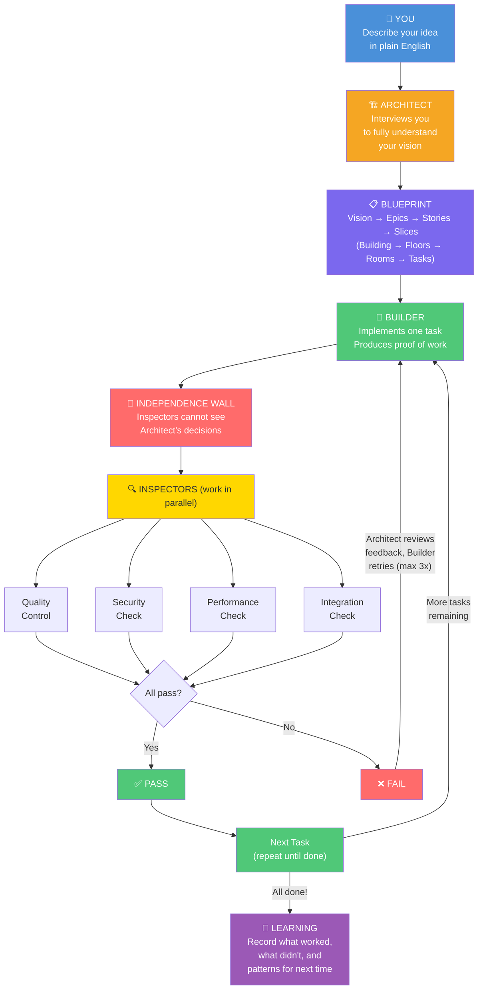

# ACOS Process Diagram — Layman Edition

## Text Diagram (paste anywhere)

```
╔═══════════════════════════════════════════════════════════════════════╗
║                        ACOS — How It Works                          ║
║              "You describe it. The system builds it."               ║
╚═══════════════════════════════════════════════════════════════════════╝

    ┌──────────┐
    │   YOU    │  "I want an app that does X, Y, Z..."
    └────┬─────┘
         │
         ▼
    ┌──────────────────────────────────────────┐
    │          🏗️  THE ARCHITECT               │
    │  Interviews you to understand your idea  │
    │  Asks: Who uses it? What features?       │
    │        How big? What tech? Constraints?  │
    └────────────────┬─────────────────────────┘
                     │
                     ▼
    ┌──────────────────────────────────────────┐
    │         📋  THE BLUEPRINT                │
    │                                          │
    │  Your idea gets broken down into:        │
    │                                          │
    │  Vision ─── "The whole building"         │
    │    └─ Epics ─── "Each floor"             │
    │        └─ Stories ─── "Each room"        │
    │            └─ Slices ─── "Each task"     │
    │               (wire this outlet,         │
    │                paint that wall)           │
    └────────────────┬─────────────────────────┘
                     │
                     │  For each slice (task):
                     ▼
    ┌──────────────────────────────────────────┐
    │         👷  THE BUILDER                  │
    │  Writes the code for this one task       │
    │  Stays within assigned boundaries        │
    │  Produces proof of work (evidence)       │
    └────────────────┬─────────────────────────┘
                     │
                     ▼
       ══════════════════════════════
       ║   🧱  INDEPENDENCE WALL   ║
       ║  (Inspectors can't see    ║
       ║   Architect's decisions)  ║
       ══════════════════════════════
                     │
                     ▼
    ┌──────────────────────────────────────────┐
    │     🔍  THE INSPECTORS  (in parallel)    │
    │                                          │
    │  ┌────────┐ ┌────────┐ ┌────────┐       │
    │  │Quality │ │Security│ │Perfor- │       │
    │  │Control │ │  Check │ │ mance  │       │
    │  └───┬────┘ └───┬────┘ └───┬────┘       │
    │      │          │          │             │
    │  ┌───┴──────────┴──────────┴───┐        │
    │  │    Integration Check         │        │
    │  │ (does it fit with the rest?) │        │
    │  └──────────────┬──────────────┘        │
    └─────────────────┼────────────────────────┘
                      │
               ┌──────┴──────┐
               │             │
          ┌────▼────┐  ┌─────▼─────┐
          │  PASS ✓ │  │  FAIL ✗   │
          └────┬────┘  └─────┬─────┘
               │             │
               │             └──────► Architect fixes
               │                      the feedback,
               │                      Builder tries again
               │                      (max 3 rounds)
               ▼
    ┌──────────────────────────────────────────┐
    │         ✅  MOVE TO NEXT TASK            │
    │  Repeat for every slice, story, epic     │
    │  until the full vision is complete       │
    └────────────────┬─────────────────────────┘
                     │
                     ▼
    ┌──────────────────────────────────────────┐
    │         🧠  THE LEARNING STEP            │
    │  System writes down what it learned:     │
    │  • What worked well                      │
    │  • What went wrong                       │
    │  • Patterns to reuse next time           │
    │  (Gets smarter with every project)       │
    └──────────────────────────────────────────┘
```


## Mermaid Diagram (render at mermaid.live or in any Markdown viewer)




## One-Page Summary (for context alongside the diagram)

| Role | Who | Job |
|------|-----|-----|
| **You** | The human | Describe what you want, answer questions |
| **Architect** | AI manager | Understands your idea, makes the plan, coordinates everyone |
| **Builder** | AI developer | Writes the actual code, one task at a time |
| **Inspectors** | 4 separate AI reviewers | Each checks quality, security, performance, and fit — independently |
| **Memory** | AI librarian | Remembers everything from every project |
| **Learning** | AI analyst | Extracts lessons so the system improves over time |

**Key idea:** The inspectors are deliberately kept behind a wall — they cannot see the architect's notes or each other's work. This prevents groupthink and ensures honest, independent reviews. The rules for inspection are set by humans only.
